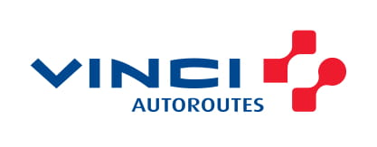

# Les facilitateurs

## Accompagnement pédagogique, choix des formats

### [MobilityData](https://mobilitydata.org/)

## Accompagnement dans l'amélioration des formats existants

### [Association des acteurs de l'autopartage ](https://asso-autopartage.fr/about.html)

[ Extension du format GBFS](https://docs.google.com/document/d/1bgNsiTcTfjKxG6khGq0ro0x-vEaToihp0_t-krGyj1o/edit) \[ En cours d'élaboration \]

## Accompagnement dans l'élaboration de schéma de données 

### Vélo & Territoires 

[Schéma national d'aménagements cyclables ](https://schema.data.gouv.fr/etalab/schema-amenagements-cyclables/latest.html)  
[Schéma national de comptage vélo](https://docs.google.com/spreadsheets/d/18aAUucg5FGlvXug_bynrY7Kr_dMGUS6Z85xsJohhnLE/edit#gid=258782490) \[ En cours d'élaboration \]

## Accompagnement dans l'ouverture des données mobilité

### [Geovelo](https://www.geovelo.fr/)

**Base nationale des aménagements cyclables - Base consolidée d'OpenStreetMap \[ en cours d'élaboration \]**

 

### [**Zenbus**](https://zenbus.fr/)\*\*\*\*

\*\*\*\*[**Données temps-réel**](https://transport.data.gouv.fr/datasets?type=public-transit&filter=has_realtime)\*\*\*\*

   
****

### [Cityway](https://www.cityway.fr/)

#### [Données temps-réel](https://transport.data.gouv.fr/datasets?type=public-transit&filter=has_realtime)

### [Mecatran](https://www.mecatran.com/fr/)

#### [Données temps-réel](https://transport.data.gouv.fr/datasets?type=public-transit&filter=has_realtime)

### [RATP Dev](https://www.ratpdev.com/)

\*\*\*\*[**Données temps-réel** ](https://transport.data.gouv.fr/datasets?type=public-transit&filter=has_realtime)\*\*\*\*

### [Rézo Pouce](https://www.rezopouce.fr/)

 [**Base nationale des lieux de covoiturage** ](https://transport.data.gouv.fr/datasets/base-nationale-des-lieux-de-covoiturage/)\*\*\*\*

### [Vinci Autoroutes ](https://www.vinci-autoroutes.com/fr)

 [**Base nationale des lieux de covoiturage** ](https://transport.data.gouv.fr/datasets/base-nationale-des-lieux-de-covoiturage/)\*\*\*\*


Vous voulez rejoindre notre communauté de facilitateurs ? Contactez nous à l'adresse  [contact@transport.beta.gouv.fr](mailto:contact@transport.beta.gouv.fr)

  
Nous serons ravis de collaborer avec vous


