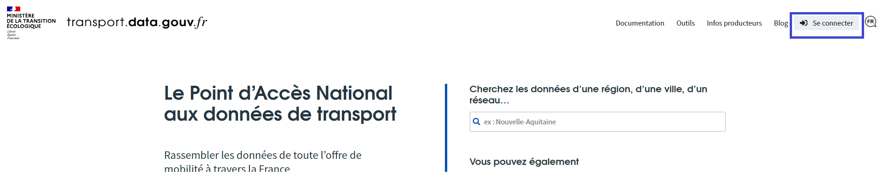

# Publier des données

## Comment publier des données sur transport.data.gouv.fr ?


Tous les jeux de données référencés sur transport.data.gouv.fr sont des données publiées préalablement sur data.gouv.fr. Nous proposons un outil pour publier et mettre à jour vos données depuis transport.data.gouv.fr mais elles seront également publiées et mises à jour sur data.gouv.fr.   
La documentation de data.gouv.fr peut également être pertinente pour répondre à certains de vos problèmes, vous pouvez la retrouver ici : [https://doc.data.gouv.fr/](https://doc.data.gouv.fr/)


### Créer un compte utilisateur sur data.gouv.fr

Si vous ne disposez de compte sur data.gouv.fr, il sera nécessaire d'en créer un pour toutes les opérations suivantes. 

Pour créer votre compte utilisateur personnel \(vous pourrez ensuite rejoindre ou créer une organisation\) rendez-vous ici : [https://www.data.gouv.fr/fr/register](https://www.data.gouv.fr/fr/register)

### Créer une organisation sur data.gouv.fr

Le préalable à toute publication de données est la création d'une _organisation_ sur data.gouv.fr si elle n'existe pas. C'est sous ce nom d'organisation que seront publiées les données.

Vous pouvez rechercher votre organisation dans le moteur de recherche de data.gouv.fr : [https://www.data.gouv.fr/fr/organizations/](https://www.data.gouv.fr/fr/organizations/)

1. Si votre organisation existe, il faut alors demander à un administrateur de votre organisation de vous ajouter en tant que membre à votre organisation. Pour cela il devra se rendre dans son espace administration sur data.gouv.fr et ajouter votre compte à la liste des membres de l'organisation. Si aucun administrateur de votre organisation ne peut faire cette opération contactez l'équipe transport.data.gouv.fr à cette adresse : contact@transport.beta.gouv.fr.
2. Si votre organisation n'existe pas, il faut la créer sur cette page : [https://www.data.gouv.fr/fr/admin/organization/new/](https://www.data.gouv.fr/fr/admin/organization/new/)

### Publier un jeu de données


Nous présentons ici la méthode pour publier un jeu de données depuis transport.data.gouv.fr qui propose un parcours simplifié pour la publication de données sur le thème de la mobilité. La même opération pourrait être réalisée sur data.gouv.fr


 Plusieurs méthodes permettent de publier un jeu de données sur data.gouv.fr, nous présenterons ici 3 méthodes : 

1. Publication des données par transport.data.gouv.fr \(méthode générique\)
2. Publication des données par moissonnage \(méthode adaptée si vous disposez d'un portail open data local\)
3. Publication des données par publier.etalab.studio \(méthode adaptée pour publier un jeu de données répondant à un schéma national référencé sur schema.data.gouv.fr \(bornes IRVE, aires de covoiturage, stationnement cyclable...\)\)

#### **1. Méthode transport.data.gouv.fr**

* Se connecter sur transport.data.gouv.fr \(à partir de son compte data.gouv.fr\) : [https://transport.data.gouv.fr/login/explanation?redirect\_path=%2F](https://transport.data.gouv.fr/login/explanation?redirect_path=%2F)

* Accéder à votre espace producteur à cette adresse : [https://transport.data.gouv.fr/espace\_producteur](https://transport.data.gouv.fr/espace_producteur)
* Cliquer sur "Publier un jeu de données"

* Choisir _"publier en tant qu'organisation"_ et en sélectionnant l'organisation pertinente
* Un **formulaire** vous permet de décrire votre jeu de données :
  * **Titre :** nous vous recommandons d'indiquer dans le titre le contenu du jeu de données et la couverture géographique des données et le format des données si cela est pertinent. Voici quelques exemples :
    * Horaires théoriques du réseau Astuce - Métropole de Rouen \(GTFS\)
    * Aménagements cyclables - Grand Poitiers
    * Parkings hors voirie - Ville d'Annecy
  * **Description :** préciser le contenu des données, leur rythme de mise à jour, leur mode de production...
  * **Licence :** choisir Licence ouverte/Open Licence version 2.0 ou Open Data Commons Open Database License \(ODbL\)
  * **Fréquence de mise à jour :** préciser si vous connaissez le rythme de mise à jour
  * **Mots clefs :** il est généralement utile de préciser le format des données dans les tags. Comme gtfs ou irve... Certains tags sont attendus si les données correspondent à un schéma hébergé sur schema.data.gouv.fr
* Un second formulaire vous permet d'ajouter des ressources au jeu de données. Pour importer votre premier fichier, cliquez sur le bouton Choisissez un fichier de votre ordinateur. Une fois votre fichier importé, vous pouvez le décrire en complétant le formulaire qui apparaît alors sur votre écran. Si votre jeu de données contient plusieurs fichiers, remplissez un formulaire par fichier. Il est également possible de référencer un fichier de données distant en utilisant une URL plutôt que de déposer un fichier. 

Vous pouvez alors publier le jeu de données. Nous serons alerté de sa publication et nous nous chargerons de son référencement sur transport.data.gouv.fr. 


Une fois ces formulaires remplis vous pourrez décider de publier "publiquement" les données ou de manière "privée" \(c'est-à-dire non visible par des utilisateurs non administrateurs de la plateforme\). Si vous choisissez "privé" pour une raison, merci de nous signaler la publication \(à l'adresse contact@transport.beta.gouv.fr\) car notre système d'alerte ne nous permet pas de détecter les jeux de données publiés de manière privée \(quand bien même ils sont ensuite rendus publics\).


#### **2. Méthode moissonnage**

Il est également possible de faire moissonner votre portail open data et ainsi faire référencer vos données sur data.gouv.fr. Pour cette méthode nous recommandons de suivre ce tutoriel : [https://doc.data.gouv.fr/jeux-de-donnees/demander-a-datagouvfr-de-moisonner-votre-site/](https://doc.data.gouv.fr/jeux-de-donnees/demander-a-datagouvfr-de-moisonner-votre-site/)

#### **3. Publication par publier.etalab.studio**

L'outil[ publier.etalab.studio](https://publier.etalab.studio/) est adapté pour publier des jeux de données correspondant à un schéma national référencé sur schéma.data.gouv.fr comme les bornes de recharges des véhicules électrique \(IRVE\), le stationnement hors voirie, les aménagements cyclables, les aires de covoiturage, le stationnement cyclable. 


Les données de mobilité publiées seront utilisées par transport.data.gouv.fr et les réutilisateurs de la plateforme. S'il s'agit de jeux de données sur les horaires théoriques ou temps-réel de transports en commun, de vélos en libre service, d'aménagements cyclables, d'autopartage, les jeux de données seront référencés manuellement par l'équipe de transport.data.gouv.fr sur notre site. 

D'autres données ne sont pas référencées mais intégrées à des bases nationales les jeux de données ne sont pas référencés individuellement mais intégrés à des bases nationales. C'est le cas pour les IRVE, le stationnement hors voirie ou les aires de covoiturage. 

Dans tous les cas, si vos données ne sont pas référencées ou intégrées à une base nationale, merci de nous le signaler à l'adresse contact@transport.beta.gouv.fr.


## L’offre de services de l’équipe du PAN pour les producteurs de données

* **Accompagnement technique et opérationnel** des producteurs dans la mise en qualité et en conformité de leurs données \(analyse, recommandations, suivi\), conversion au format normalisé exigé par le règlement européen. Cet accompagnement permet une mise en qualité au moindre coût ;
* **Harmonisation juridique** des conditions de réutilisation des données via le recours à la licence ODbL, adoptée par le groupe de travail animé par Etalab ;
* **Moissonnage possible** : si un producteur de données dispose déjà de son propre portail de données ouvertes, le PAN peut alors agir en tant que répertoire, donnant un accès direct à ces données stockées ailleurs ;
* **Simplification des relations avec les réutilisateurs**, qui n’ont plus besoin de contacter chaque fournisseur de données. Le PAN recueille les observations sur les données publiées et les détenteurs de ces données y répondent ;
* **Conversion automatique de données au format GTFS vers le format NETEX**, via le [convertisseur Gtfs2NetexFr](http://lafabriquedesmobilites.fr/articles/innovation/gtfs2netexfr-nouvel-outil-open-source-pour-faciliter-la-production-de-donnees-transport-au-format-netex/), afin de faciliter le respect des obligations réglementaires par les producteurs de données ;
* **Conversion automatique de données au format GTFS-RT vers le format SIRI-Lite** ;
* **Économies sur les frais de serveur** avec la possibilité d’héberger sur les serveurs du PAN les flux temps-réel à haut niveau de sollicitation.


_**Pour les données temps-réel** : l’information en temps réel permet d’augmenter sensiblement l’usage des différents services de mobilité, car l’utilisateur maîtrise mieux son temps d’attente et de trajet. Le producteur fournit un flux de données mis à jour toutes les 30 secondes. Pour cette raison, la charge sur les serveurs est une crainte légitime de nombreux producteurs. Le PAN teste actuellement une solution dans laquelle il joue le rôle de serveur mandataire \(proxy\) : seul le PAN effectue un téléchargement toutes les 30 secondes chez le producteur et les réutilisateurs téléchargent depuis le PAN._


