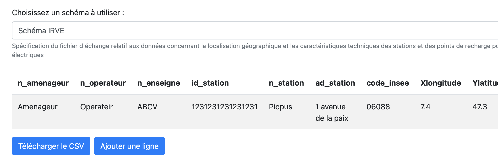
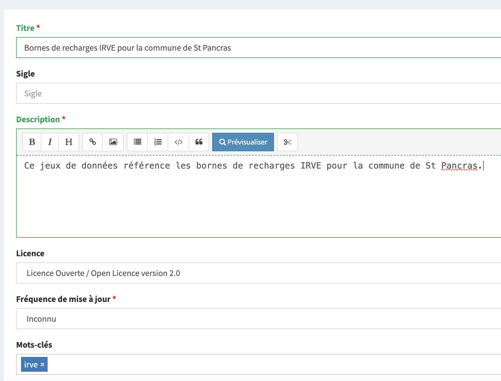
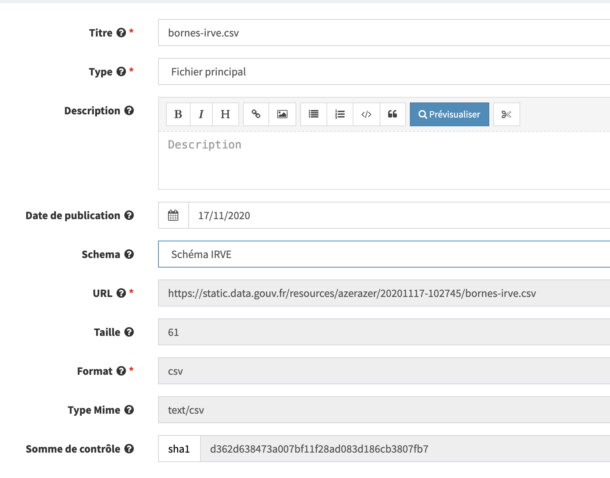

# Infrastructures de recharge de véhicules électriques \(IRVE\)

## Contexte

Dans le but de constituer un répertoire national des Infrastructures de recharge pour véhicules électriques \(IRVE\), ouvert et accessible à tous, les collectivités locales porteuses d’un projet d’installation d’IRVE doivent, au fur et à mesure de la mise en service des stations, publier sur la plateforme data.gouv.fr les données statiques relatives à la localisation et aux caractéristiques techniques de ces installations selon les modalités définies dans l’arrêté du [12 janvier 2017](https://www.legifrance.gouv.fr/jorf/id/JORFTEXT000033860733).

Etalab consolide l'ensemble des jeux de données produits par les différents acteurs territoriaux sur [un jeu de donnée consolidé](https://www.data.gouv.fr/fr/datasets/fichier-consolide-des-bornes-de-recharge-pour-vehicules-electriques/)\*. Celui-ci a pour objectif d'être le plus exhaustif possible et ambitionne de regrouper l'ensemble des bornes IRVE françaises.

Pour pouvoir être intégrés à ce fichier, les différents producteurs se doivent d'effectuer un certain nombre d'actions décrites sur cette page.

## Création d'un fichier de données conforme

Les données collectées doivent respecter un formalisme particulier \(schéma de données\) décrit sur [la page dédiée aux IRVE sur schema.data.gouv.fr](https://schema.data.gouv.fr/etalab/schema-irve/latest.html).

Les données sont à remplir au **format CSV**, encodage UTF-8.

Plusieurs solutions existent pour générer ce fichier CSV.

### **Utilisation de notre outil d'aide à la saisie**

Pour faciliter le remplissage des données, Etalab met à disposition [un générateur CSV](https://csv-gg.etalab.studio/?schema=etalab%2Fschema-irve) conforme au schéma de données, vous permettant de remplir les différents champs demandés. Cet outil vous permet de vous assurer que les données que vous remplissez sont au bon format.

Une fois l'ensemble de vos données remplies, téléchargez le fichier de données au format CSV sur votre ordinateur, puis référez vous aux instructions plus bas pour le déposer sur data.gouv.fr.

### **Production du fichier CSV par vos propres moyens**

Si vous désirez créer le fichier vous-même, vous pouvez partir de ce [fichier exemple](https://raw.githubusercontent.com/etalab/schema-irve/master/exemple-valide.csv).

Si vous préférez utiliser un tableur pour produire ce fichier, nous recommandons [LibreOffice](https://fr.libreoffice.org) \(outil libre et gratuit\) plutôt qu'Excel. La gestion des fichiers CSV y est en effet bien meilleure.

Une fois votre fichier produit, vous pouvez utilisez [cet outil de validation](https://validata.etalab.studio/table-schema?schema_name=schema-datagouvfr.etalab%2Fschema-irve) pour vérifier que vos données ne comportent aucune erreur de format avant de les charger sur data.gouv.fr.

## Chargement des données sur data.gouv.fr

Une fois vos données enregistrées, il vous faudra les charger sur la plateforme data.gouv.fr en suivant les étapes ci-dessous.

### **Création d'un compte**

Si vous n'en avez pas déjà un, créez un compte à votre nom sur [data.gouv.fr](https://www.data.gouv.fr).

📖 Référence : [https://doc.data.gouv.fr/gestion-du-compte/creer-un-compte/](https://doc.data.gouv.fr/gestion-du-compte/creer-un-compte/).

### **Création ou choix d'une organisation**

Si elle n'existe pas déjà, créez une organisation depuis votre compte. Cette organisation peut représenter votre collectivité ou votre société.

📖 Référence : [https://doc.data.gouv.fr/organisations/creer-une-organisation/](https://doc.data.gouv.fr/organisations/creer-une-organisation/)

Si l'organisation sous laquelle vous souhaitez publier existe déjà, vous pouvez la rejoindre

📖 Référence : [https://doc.data.gouv.fr/organisations/demander-a-rejoindre-une-organisation/](https://doc.data.gouv.fr/organisations/demander-a-rejoindre-une-organisation/).

### **Création d'un jeu de données**

Créez un jeu de données pour le compte de votre organisation.

📖 Référence : [https://doc.data.gouv.fr/jeux-de-donnees/publier-un-jeu-de-donnees/](https://doc.data.gouv.fr/jeux-de-donnees/publier-un-jeu-de-donnees/)

Lorsque vous créez votre jeu de données, ajoutez le mot-clé \(tag\) `irve`.

### **Ajout d'une ressource**

Ajoutez une ressource en y attachant le fichier CSV contenant la liste des bornes à référencer.

📖 Référence : [https://doc.data.gouv.fr/jeux-de-donnees/publier-un-jeu-de-donnees/\#3-importer-vos-fichiers](https://doc.data.gouv.fr/jeux-de-donnees/publier-un-jeu-de-donnees/#3-importer-vos-fichiers)

Lors de l'ajout d'une nouvelle ressource sur l'interface d'administration de la plateforme, n'oubliez pas de remplir le champ "Schéma" en indiquant que votre ressource obéit au "Schéma IRVE" \(voir la capture d'écran ci-dessous\).

## Et après ?

Une fois l'ensemble de ces actions réalisées, vos données seront correctement référencées sur la plateforme data.gouv.fr et automatiquement rassemblées dans le fichier consolidé des IRVE. La consolidation est aujourd'hui mensuelle \(tous les 25 du mois\).

_\*Vous pouvez accéder au code source permettant la génération de ce fichier_ [_ici_](https://github.com/etalab/notebooks/tree/master/irve)

